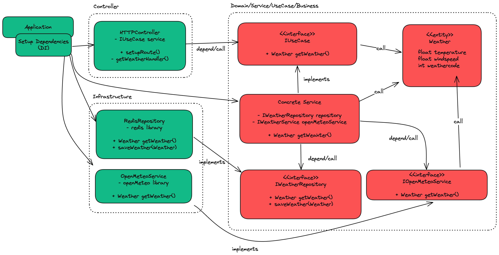

# Clean Architecture

Implementing Clean Architecture with Go.

## Definition

Clean Architecture is a software design philosophy that promotes the separation of concerns and the organization of code in a way that makes it easy to understand, maintain, and test. It was introduced by Robert C. Martin (Uncle Bob) and is often used in the development of complex systems.

## Key Principles

1. **Separation of Concerns**: Different parts of the application should have distinct responsibilities.
2. **Independence**: The business logic should be independent of frameworks, databases, and user interfaces.
3. **Testability**: The architecture should facilitate easy testing of the business logic.
4. **Flexibility**: The system should be easy to change and adapt to new requirements.

## Overview


The concentric circles to represent the layers in a software system. The general principle is:

1. The closer to the center, the more abstract and less dependent on specific details. (high level)
2. The further out, the more detailed and dependent on frameworks, libraries, UI, databases, etc. (low level)

> [!NOTE]  
> The arrows in the circle do not represent call direction; they represent dependency direction, meaning the low level will depend on the high level.


## Layers of Clean Architecture

Clean Architecture is typically divided into several layers, each with its own responsibilities:

1. **Entities**: Represent the core business logic and rules. They are independent of any external systems.
2. **Use Cases**: Contain the application-specific business rules. They orchestrate the flow of data to and from the entities.
3. **Interface Adapters**: Convert data from the format most convenient for the use cases and entities to the format most convenient for external agencies such as databases and web services.
4. **Frameworks and Drivers**: Contain the details of the external systems such as databases, web frameworks, and user interfaces.

## Dependency Inversion

1. Inner layers must not depend on outer layers. High-level should not depend on low-level, both should depend on abstractions.
2. Data flows from the outside in, but dependencies only point outward via Dependency Inversion.

## Benefits

- **Maintainability**: The separation of concerns makes the codebase easier to understand and maintain.
- **Testability**: Business logic can be tested independently of external systems.
- **Flexibility**: The system can be easily adapted to new requirements or changes in technology.

## Implement Clean Architecture with Go

The business logic uses Open-Meteo, a third-party service, to retrieve weather data. The data is stored in Redis with an expiration time of one hour. When a user makes a request, the system first checks Redis:

- If the data is available, it is returned to the user immediately.
- If the data is not found, the system fetches it from Open-Meteo, returns it to the user, and simultaneously caches it in Redis for future requests.

### Sequence diagram


### Class diagram



### Project structure

```
weather-app/
│
├── controller/        # Main entry points (e.g., server)
├── entity/            # Business entities
├── service/           # Use cases
├── infrastructure/    # API calls, database, etc.
├── go.mod             # Go module file
└── main.go            # Entry point
```

## Conclusion

Clean Architecture provides a robust framework for building scalable and maintainable software systems. By adhering to its principles, developers can create applications that are easier to understand, test, and evolve over time.
